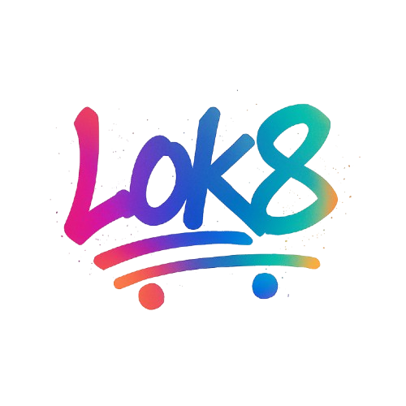

## Software for skaters by BurazTorek 🛹

## Introduction to Lok8

Lok8 is a smart skateboarding app that uses motion sensors and machine learning algorithms to analyze skate sessions in real-time. It tracks and visually renders each run in 3d environments. The app evaluates session data, including trick success rate, jump height, rotations, combo choreography, and heatmaps of frequently used park zones. An AI-powered trick coach "Ollie" evaluates your skate session and recommends your next skill progression step based on your performance.

#### Problems

- Skaters often lack structured feedback and performance tracking.

- Public skateparks offer no real-time info on crowd levels or obstacle popularity.

- It’s hard to measure personal progress or find optimal spots for practicing specific tricks.

- When designing skateparks, urban planners often rely on assumptions or limited feedback, making it difficult to determine which features skaters actually use or need.

#### Main focus

- Combine AI session analysis with real-time park data.

- Help users improve their skateboarding through personalized coaching and smart insights.

- Enhance the experience of public skateparks using digital tools.

- Customization and detailed planning of skateparks based on current use.

## How does Lok8 work?

Our software operates seamlessly across both the edge and the cloud—bringing together the speed and control of embedded hardware with the scalability and intelligence of cloud computing. At the core is our custom firmware, built specifically for embedded devices, enabling real-time telemetry collection directly from the source. 

This data is transmitted over modern, ultra-fast protocols to our cloud infrastructure, where it powers advanced machine learning models and AI-driven analysis. What sets us apart is not just the intelligence, but the experience: we render real-time 3D environments that visualize the skateboard’s movement with astonishing precision—thanks to the custom hardware built right into it. 

All of this is brought to life through a cutting-edge, lightning-fast web-based application. Users get full access to rich, interactive visualizations, live data streams, and smart insights—anytime, anywhere. This is more than just software. It's a tightly integrated ecosystem built for performance, intelligence, and user experience at every level.

## Innovation and potential of Lok8

This is a pioneering fusion of skateboarding, AI, and smart city tech. It introduces heatmaps, trick performance zones, and real-time crowd data into everyday sessions. Features like AI-selected highlight reels and a personal AI agent are novel tools transforming how skaters engage with their sport.

The concept can scale beyond skateboarding—into BMX, parkour or scooter riding. It can expand also to other sports such as skiing, snowboarding,... It could connect with city systems to improve park planning or host local brand activities. With global expansion, the platform can create a network of smart parks and become the go-to digital tool for action sports.

## Lok8 companion »Ollie«

“Ollie” is more than just an AI skate coach — it’s a smart, evolving training companion designed to guide skaters through their personal progression journey. Built on cutting-edge LLMs, Ollie studies each session in detail, evaluating trick success rates, jump height, combo patterns, and park usage. It doesn't just record your activity — it understands it.

After each session, Ollie processes your performance to identify strengths, weaknesses, and areas of potential. Then, it recommends the next trick or zone to master based on your current level, past successes, and typical learning curve. Whether you're working on consistency, adding rotations, or increasing difficulty, Ollie offers suggestions tailored specifically to you.
